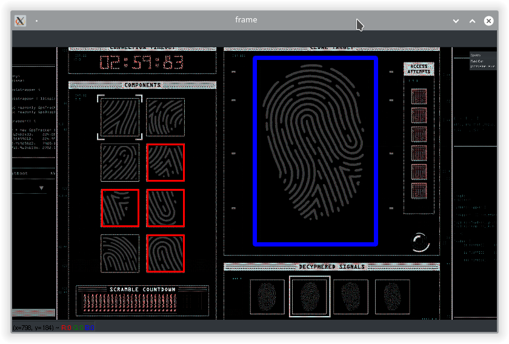

# GTAV-FingerprintSolver
Solves the fingerprint "hack" for you within GTA V

## Install
Requires python3 with opencv-python and mss installed via pip

Download and install python3 from https://www.python.org/downloads/windows/

From windows command prompt, run the following commands;
```
pip3 install opencv-python
pip3 install mss
pip3 install win32gui
```

## Running
The simplest way to run the script will be through IDLE (this will have been installed at the same time as python, search for it in windows start menu).

Open the `__main__.py` file within IDLE then hit F5 to start. Ensure GTAV is running and in borderless mode. A new window will open, scanning your screen for fingerprints and displaying the solution to any found


